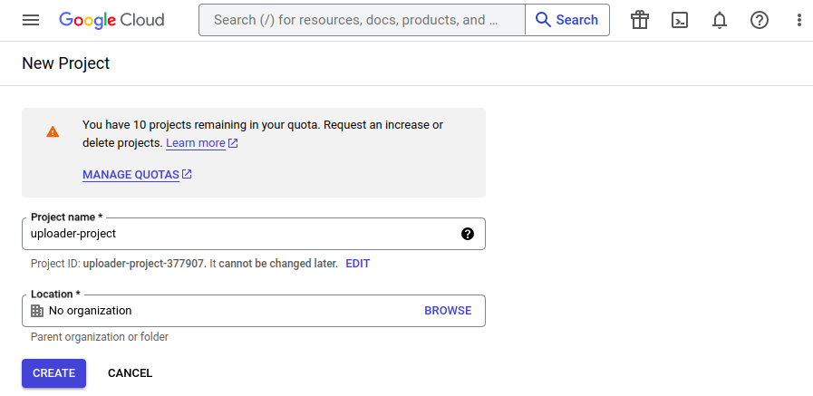
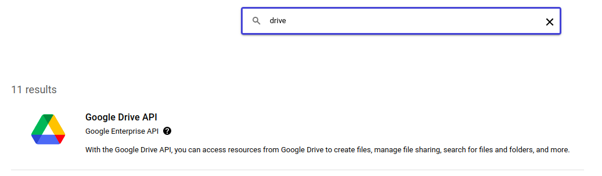
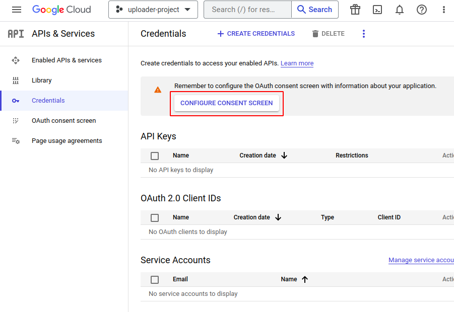
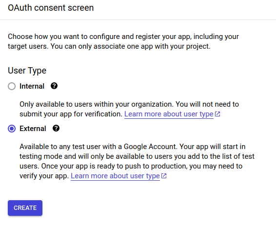
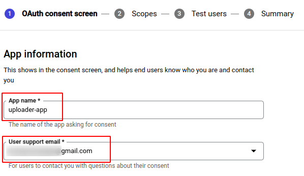
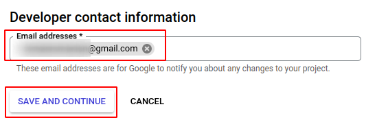
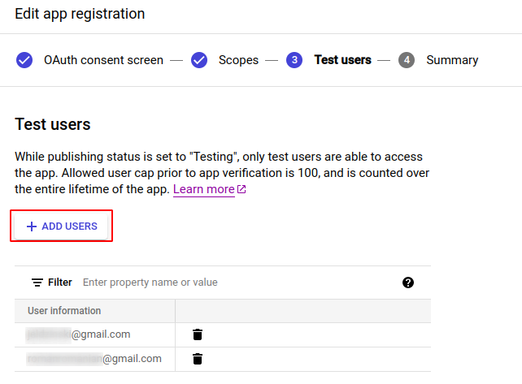
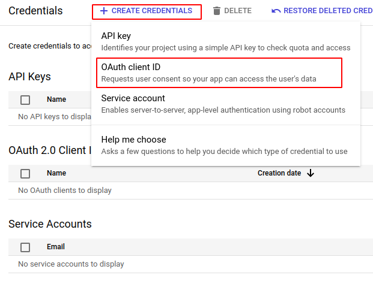
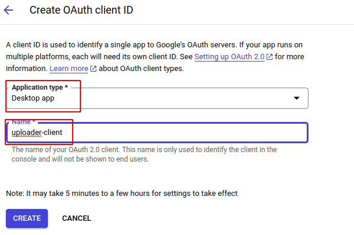

# Google Drive Uploader

## INTRO

The script's purpose is to upload the contents of specified dir to the directory 
on Google Drive.

## SETUP

### Local environment setup

- Ensure you have python3.9+ installed
- Clone the repo and navigate to the project dir:
```shell
$ git clone git@github.com:rabcau/google-drive-uploader
$ cd google-drive-uploader
```
- Create a virtual env in any convenient way, and activate it. For example:
```shell
$ python3 -m venv venv
$ source venv/bin/activate
```
- Install the project dependencies
```shell
$ pip install -r requirements.txt
```

### Google Cloud Project

To interact with Google Drive programmatically you should own a Google Cloud project
or have access to a project with appropriate permissions. Follow the steps below
to create and set up your own Google Cloud project. If you're permitted to use
some project with Google Drive API enabled feel free to jump to [this](#avoiding-the-browser-auth)
section.

#### Create a project

Visit [create a project](https://console.cloud.google.com/projectcreate) in Google Cloud
Console, specify the project name, and push **Create** button.



#### Enable Google Drive API

After the project creation you should activate Google Drive API for you project. Visit
[api's library](https://console.cloud.google.com/apis/library) page, click on Google
Drive API and **ENABLE** the API.



#### Create access credentials

Visit you project [credentials](https://console.cloud.google.com/apis/credentials) page
to create access credentials. First you should configure **Consent Screen**.



Pick an external user type as shown in the picture below and click on **CREATE** button:



Specify the app name, the user support email, and developer contact. Then click on
**SAVE AND CONTINUE** button.




Do not change anything at the Scopes step (2), then specify the test users on the
third step:



Save the changes, review the settings at the Summary step, then go back to the
[credentials](https://console.cloud.google.com/apis/credentials) page. Click on the
**CREATE CREDENTIALS** button and specify the **OAuth client ID** option:



Choose the **Desktop** application type, then specify the client ID name, 
and push the **CREATE** button:



After client creation you will see the **OAuth client created** window. Click on
**DOWNLOAD JSON** button to save the credentials as a json file. Specify the name
as `client_secrets.json` and save the file in the project root.

#### Avoiding the browser auth

To avoid the authentication process at each script run create the `setting.yaml` file,
copy the content of code snippet below, and specify your project `client_id` and
`client_secret`. You can take it from `client_secrets.json`.

```yaml
client_config_backend: file
client_config:
    client_id: "<client_id>"
    client_secret: "<client_secret>"

save_credentials: True
save_credentials_backend: file
save_credentials_file: user_credentials.json

get_refresh_token: True

oauth_scope:
    - https://www.googleapis.com/auth/drive
    - https://www.googleapis.com/auth/drive.install
```

## USAGE

### Arguments:

- `source` - a path to the dir you want to upload to Google Drive. Mandatory.
```shell
$ ./upload.py docs/
```
- `--dest` - a name of the destination dir on Google Drive. Optional. If not
specified the contents of source dir will be pushed to the directory with the
same name. A destination dir will be created if it doesn't exist. If there are
multiple folders with the same name on Google Drive the contents of `source` will
be pushed to the "oldest" dest dir.
```shell
$ ./upload.py docs/ --dest dest-dir 
```
- `dest_id` - an identifier of destination dir on Google Drive. Optional. If not
specified the whole Google Drive will be scanned. If both `--dest` and `--dest_id`
are specified the `--dest` will be ignored.
```shell
$ ./upload.py docs/ --dest_id 1zHh-JKYTbMH_SwCMF3B9gFR9tspAW3yt
```

### Tips

- You will have to authenticate via browser once. After this one-time action the
credentials will be saved in the project root as a `user_credentials.json`

- If you want to constantly push the contents of source dir to a single folder on Google
Drive you can create an `.env` file, specify the `DEST_ID` envvar, and just run
`./upload.py /path/to/source/`. 
